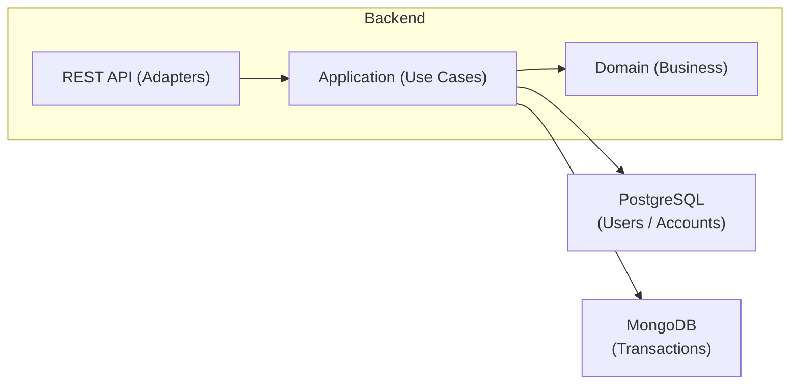

# 🏦 Bank Account Management System

A robust, production-ready banking application built with **Spring Boot** and **Hexagonal Architecture**. Features multi-database persistence, automatic transaction logging, PDF statement generation, and a complete REST API.


## 🎯 Features

### 💼 Core Banking
- **User Management** - Registration, blocking, role-based access
- **Bank Accounts** - Create accounts with multiple currencies
- **Transactions** - Deposit, withdraw, and transfer operations
- **Balance Management** - Real-time balance updates with validation

### 🗄️ Multi-Database Architecture
- **PostgreSQL** - ACID-compliant storage for users and accounts
- **MongoDB** - Flexible document storage for transaction history
- **Automatic Sync** - AOP-powered transaction logging

### 📊 Advanced Features
- **PDF Generation** - Account statements and transaction receipts
- **REST API** - Full CRUD operations with proper HTTP status codes
- **AOP Logging** - Custom annotations for cross-cutting concerns
- **Hexagonal Architecture** - Clean separation of business and infrastructure

## 🏗️ Architecture



## 🚀 Quick Start

### Prerequisites
- Java 21
- PostgreSQL 18+
- MongoDB 8.2.1+
- Maven 3.6+

### Installation

1. **Clone the repository**
   ```bash
   git clone https://github.com/yourusername/bank-account-system.git
   cd bank-account-system
   
### Database Setup

```bash
    -- PostgreSQL
CREATE DATABASE banking_system;
    -- MongoDB (automatically creates database)
```
### Configuration

#### application.yml
```
spring:
datasource:
url: jdbc:postgresql://localhost:5432/banking_system
username: postgres
password: postgres
data:
mongodb:
host: localhost
port: 27017
database: banking_transactions
```

### Run the Application
```bash
    ./mvnw spring-boot:run
```
## 📚 API Documentation

### User Management ✔️

| Method | Endpoint                  | Description       |
|--------|----------------------------|-------------------|
| GET    | `/api/users`               | Get all users     |
| POST   | `/api/users/register`      | Register new user |
| GET    | `/api/users/{id}`          | Get user by ID    |
| POST   | `/api/users/{id}/block`    | Block user        |

### Account Operations ✔️

| Method | Endpoint                                      | Description         |
|--------|------------------------------------------------|---------------------|
| GET    | `/api/accounts`                                | Get all accounts    |
| POST   | `/api/accounts/users/{userId}/create`          | Create account      |
| POST   | `/api/accounts/{accountNumber}/deposit`        | Deposit money       |
| POST   | `/api/accounts/{accountNumber}/withdraw`       | Withdraw money      |
| GET    | `/api/accounts/{accountNumber}/balance`        | Check balance       |

### Transactions 💳

| Method | Endpoint                                         | Description               |
|--------|---------------------------------------------------|---------------------------|
| POST   | `/api/transactions/transfer`                     | Transfer between accounts |
| GET    | `/api/transactions/account/{accountNumber}`      | Get account transactions  |

### PDF Generation 📄

| Method | Endpoint                                           | Description                      |
|--------|-----------------------------------------------------|----------------------------------|
| GET    | `/api/pdf/statement/{accountNumber}`                | Download account statement       |
| GET    | `/api/pdf/receipt/{transactionId}`                  | Download transaction receipt     |

## 🎨 Code Examples
### Custom AOP Transaction Logging
```java
@LogTransaction(type = "TRANSFER", description = "Money transfer")
public TransferResult transfer(String fromAccount, String toAccount, BigDecimal amount) {
    // Business logic automatically logged to MongoDB
}
```
### Hexagonal Architecture Port
```java
// Port (Interface)
public interface UserRepository {
User save(User user);
Optional<User> findById(Long id);
}

// Adapter (Implementation)  
@Repository
public class UserPostgresRepository implements UserRepository {
// PostgreSQL-specific implementation
}
```
## 🧪 Testing
```bash
    ./mvnw test
```
### Test with Postman

    1. Import the included Banking-API.postman_collection.json

    2. Set base URL to http://localhost:8080

    3. Execute the complete user journey

### Sample Test Flow
```bash
  # 1. Register user
POST /api/users/register
{"username": "john_doe", "email": "john@email.com", ...}

# 2. Create account
POST /api/accounts/users/1/create?currency=USD

# 3. Deposit money
POST /api/accounts/ACC123456/deposit?amount=1000.00

# 4. Generate statement
GET /api/pdf/statement/ACC123456?periodStart=2024-01-01&periodEnd=2024-12-31
```

## 📊 Database Schema

### PostgreSQL (Users & Accounts)
```sql
users (id, username, email, password, full_name, blocked, role)
bank_accounts (id, account_number, balance, currency, user_id)
```
### MongoDB (Transactions)
```json
{
"transactionId": "TXN_ABC123",
"fromAccount": "ACC123456",
"toAccount": "ACC789012",
"amount": 100.00,
"currency": "USD",
"type": "TRANSFER",
"status": "SUCCESS",
"timestamp": "2024-01-15T10:30:00Z",
"description": "Transfer between accounts"
}
```
## 🛠️ Technology Stack
    Backend: Spring Boot 3, Spring Data JPA, Spring Data MongoDB

    Database: PostgreSQL 18.1, MongoDB 8.2.1

    PDF Generation: iTextPDF 8.0

    AOP: Spring AOP with custom annotations

    Build Tool: Maven

    Java Version: 21

## 🎯 Learning Outcomes

#### This project demonstrates:

    ✅ Hexagonal Architecture implementation

    ✅ Multi-database integration strategies

    ✅ AOP for cross-cutting concerns

    ✅ Clean Code principles and patterns

    ✅ REST API design best practices

    ✅ Database relationship management

    ✅ PDF generation programmatically

    ✅ Testing strategies for complex systems

## 👨‍💻 Author

#### Amine El Haouat

    GitHub: @PhantomVisible 

    LinkedIn: https://www.linkedin.com/in/amine-el-haouat/

## 🙏 Acknowledgments

    My ArkX academy coach for presenting me with this challenge
        
    Spring Boot team for the excellent framework

    PostgreSQL and MongoDB communities

    Hexagonal Architecture concepts by Alistair Cockburn

<div align="center">

⭐ Don't forget to star this repository if you found it helpful!
</div> 